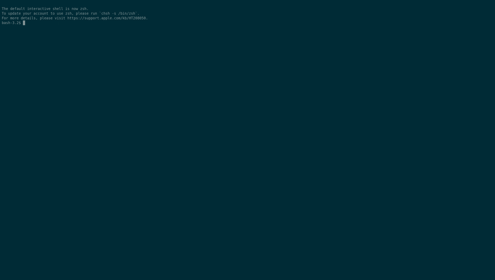

# golog-tools
[](https://travis-ci.org/weldpua2008/golog-tools)

Building the JSON lines for calltraces for logs in the following format:
[start-timestamp] [end-timestamp] [trace] [service-name] [caller-span]->[span]


### Build the code

```
go build cmd/logtracer/logtracer.go
```

### Run

```
asomeprogram | logtracer
```

### Demo


##### Gif was generated with:

```
docker run --rm -v $PWD:/data asciinema/asciicast2gif -s 2 -t solarized-dark demo.cast demo.gif
```
